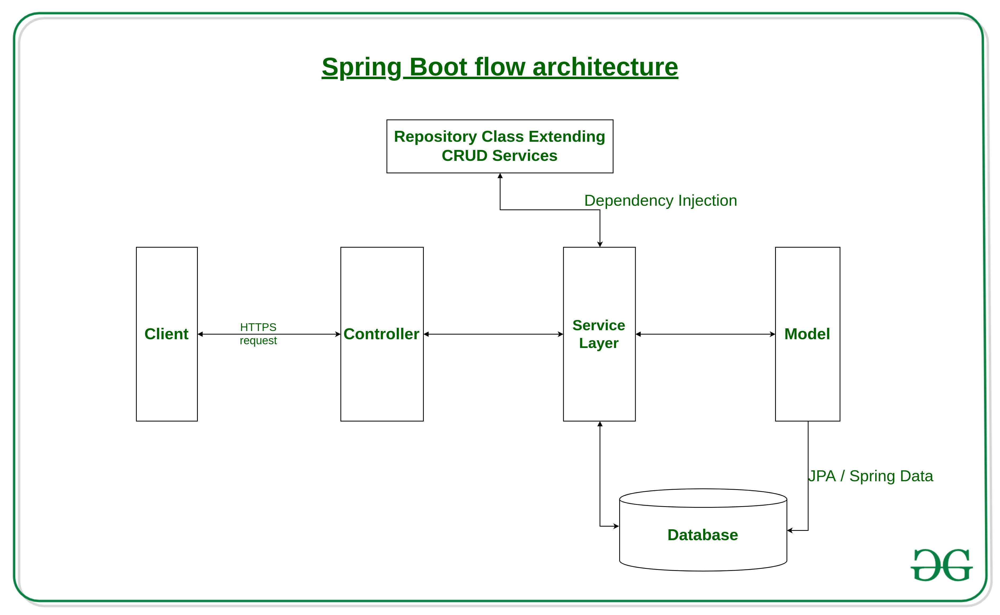

# Coding--Interview-Question-Java-Solution-Primer
**One stop place if you are looking to have java coding interview questions as well as solutions.**

* [Deque Implementation | GoldMann Sach](Interview-Coding-Question's/DequeImplementation_GoldMannSach)
* [Interactive Coding Challenges](https://github.com/donnemartin/interactive-coding-challenges)
* [System Design Primer | Architecture based question](https://github.com/donnemartin/system-design-primer)
* [All Sorting Algorithms](https://github.com/diptangsu/Sorting-Algorithms/tree/master/Java)
* [Sorting Algorithms in Java](JavaSortingAlgorithms)
* [Runtime Complexity of Java Collections](JavaCollectionsRuntimeCoplexity)
* [Real Time Stream Processing](https://netflixtechblog.com/keystone-real-time-stream-processing-platform-a3ee651812a)
* [The Vending Machine Change problem | Coins Problem](https://putridparrot.com/blog/the-vending-machine-change-problem/)
* [Amazon Interview Question -> best approach to sort the array.](Interview-Coding-Question's/AmazonInterviewQuestion)
* [Element Appeared Only Once In Array | Given an array, return the element appeared only once](Interview-Coding-Question's/FindElementInArrayAppearedOnlyOnce)
* [Counting Sort Algorithm with Negative Numbers](Interview-Coding-Question's/CoutingSortWithNegativeNumbers)
* [Linked List | delete m number of nodes from the nth node](Interview-Coding-Question's/Linked-list-delete-m-no-of-nodes-from-nth-node)
* [Fizz Buzz](Interview-Coding-Question's/fizzBuzz)
* [Given a string expression (consisting of + - ( ) operands,numbers), evaluate the expression | Amazon Interview Question](Interview-Coding-Question's/String-Epression_Evaluation)
* [String Anagrams](Interview-Coding-Question's/StringAnagrams)
* [Group Anagrams | Given a array of strings, create group of strings which are anagrams to each others](Interview-Coding-Question's/GroupAnagrams) 
* [Junit Sample Code](Interview-Coding-Question's/Junit_Solution)
* [Fabonacci Series with Recursion](Interview-Coding-Question's/FabonacciSeriesWithRecursion)
* [Decimal to Roman Conversion](Interview-Coding-Question's/DecimalToRomanConverison)
* [Find || Count the Occurence of the element in the array](Interview-Coding-Question's/CountOccurenceOfElementInArray)
* [Given two arrays, find the missing element in the second Array](Interview-Coding-Question's/FirstMissingElementInTwoArrays)
* [Sort HashMap Java Implementation](Interview-Coding-Question's/Sort-HashMap-Java) 
* [Rock-Paper-Scissor | VMWawre](Interview-Coding-Question's/RockPaperScissor)

> #### Java Spring Boot Flow Architecutre

